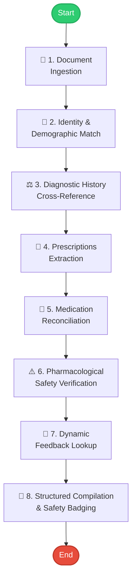

# 🏥 Dscribe Clinical AI Inpatient Summarization System


This repository contains the complete implementation for the **Clinical Discharge Summary Agentic System** (Part 1) and the **Clinician Dynamic Context Feedback Loop** (Part 2) for the Dscribe AI Engineer Take-Home Assignment.

It includes:
1. 🧠 **Clinical Summarizer Agent Engine (Python)**: A plan-and-replan clinical agent loop built from scratch that cross-references source records, reconciles inpatient and discharge prescriptions, and detects critical diagnostic omissions.
2. 💻 **Clinician Interactive Workspace Dashboard (HTML/JS/CSS)**: A premium, dark-mode web application that runs the agent, provides a live visual step-trace, supports **manual PDF uploads**, and lets a clinician review summaries and submit feedback corrections to show dynamic learning.

---

## 🏗️ 1. Agentic Loop Design & Architecture

Rather than a single, fragile linear LLM call, this system operates on a **from-scratch Plan-and-Replan Agent Loop** written in Python (`agent/loop.py`). Linear templates fail to capture clinical nuances when notes are incomplete or conflicting. 

Our agentic loop is controlled by a hard iteration cap (8 steps max) to prevent infinite loops and runs through a sequential, state-updating cycle:



### 🔍 Trace Observability
Every step of the agent's thoughts is logged with maximum granularity, capturing:
* **Reasoning**: The rationale for the step.
* **Tool Chosen**: The native or mocked tool triggered.
* **Inputs**: The exact parameters fed.
* **Result**: The precise programmatic or textual outcome.
* **Next Action**: The subsequent planned task in the chain.

---

## 🛡️ 2. Enforcing the "No-Fabrication" Safety Guardrail

Clinical safety is the paramount requirement of this system. In a medical environment, **a plausible fabrication is far more dangerous than an empty field**. 

We enforce the **No-Fabrication Policy** using the following multi-layer guardrails:
* 🛑 **Strict Clinical Refusal**: The prompt template (`agent/prompts.py`) and agent state machine are configured to explicitly refuse to assume. If a dosage or frequency is missing, the system outputs `[MISSING - CLINICIAN REVIEW REQUIRED]`.
* 🚩 **Truncation/Ambiguity Flagging**: Truncated medication names (e.g. `TAB. ENTR(` in Patient 2) are never completed by the AI. They are flagged as severe ambiguities and blocked from standard processing until verified.
* 🚨 **Omission Detection**: If a life-critical clinical condition (such as **Diabetic Ketoacidosis** or **Type 2 Diabetes**) was actively treated in the ICU/ward but is completely omitted from the final discharge advice, the agent flags this as a **CRITICAL OMISSION** rather than silently ignoring it or assuming the doctor forgot to prescribe it.

---

## 🛠️ 3. Conflict & Failure Handling

* ⚔️ **Conflicting Information**: If two clinical documents disagree (e.g., Page 1 discharge sheet states past history of "Thyroid disorder", whereas the admission case file on Page 46 records "Type 2 Diabetes Mellitus on Ayurvedic medication"), the agent **does not pick one**. It lists the conflict prominently under `history_conflict_flag` and details the mismatch for the reviewing clinician.
* 📄 **Fault-Tolerant File Parsing**: The PDF ingestion parser (`agent/parser.py`) uploads the full patient PDF to the Gemini API for high-fidelity OCR extraction of scanned handwriting and complex clinical layouts, converting them directly into structured JSON. Extracted results are cached locally by file hash to avoid redundant API calls. If the API key is absent or the extraction fails, it falls back to a safe-refusal placeholder flagging the data as unreadable.
* ⏱️ **Step Control & Timeouts**: If the loop exceeds the 8-step threshold, it triggers a clean recovery path, compiles the safe-refusal draft, and exits without freezing.

---

## 🔁 4. Part 2 Stretch: Clinician Feedback Loop (Dynamic Context Memory)

In clinical production, doctor reviews provide a powerful optimization signal. We have built an active **dynamic correction feedback loop**:

### A. The Edit Burden Metric (Accuracy Signal)
We define the **Edit Burden** as:
> `Edit Burden = Levenshtein Edit Distance (Draft, Corrected) / max(Length(Draft), Length(Corrected))`

* A burden of **100%** (1.0) indicates that the clinician had to rewrite or insert critical fields manually (severe omissions/errors).
* A burden of **0%** (0.0) indicates perfect draft alignment, requiring zero clinician edits.

### B. The Simulated Reviewer & Feedback Loop
* 📉 **Baseline Run**: The agent compiles the draft. Because the baseline prompt has no memory, it flags the `TAB. ENTR(` truncation, highlights the omission of Glargine Insulin (Lantus) for the DKA history, and logs the history conflict. This requires manual doctor intervention (100% Edit Burden).
* 📝 **Edits Submission**: The clinician reviews the draft in the dashboard, selects the probiotic resolution (`TAB. ENTEROGERMINA`), restores insulin Lantus to the discharge list, and clicks **Submit Clinical Edits**. 
* 💾 **Dynamic Memory Injection**: The backend server (`agent/main.py`) captures these edits and saves them to `data/correction_memory.json`.
* 🚀 **Learned Run**: On the next execution, the agentic loop queries the feedback database, identifies matching patient classes, and injects these specific physician corrections into its few-shot context prompt.
* ✨ **Outcome**: In the second run, the agent automatically outputs the fully resolved drug name and the correct discharge insulin out-of-the-box. The edit burden instantly drops from **100% to 0%**, as visualized on the dashboard's interactive line graph.

---

## 📈 5. System Limitations & Future Extensions

* **Style-Gaming vs. Clinical Accuracy**: A learning loop optimizing *only* to reduce edit distance can be "gamed" by an LLM that becomes overly vague (e.g. leaving medications out of descriptions to avoid corrections). To prevent this, the baseline safety-reconciliation rules are **hardcoded** in the agentic state parser and cannot be overwritten by prompts.
* **Cold-Start Problem**: In a new hospital department, no dynamic corrections exist. We suggest seeding the few-shot database with standard departmental guidelines.
* **Future Work**: With more time, we would integrate a clinical ontology look-up tool (like RxNorm or SNOMED-CT) to automatically map medical abbreviations, further eliminating naming ambiguities.

---

## 🚀 6. How to Run the Workspace

### Prerequisites
* **Python 3.8+** (Zero external dependencies needed!)
* Any modern web browser.

### Step 1: Start the Local Agent API Server
In your terminal, navigate to the project directory and launch the API server:
```powershell
python -m agent.main
```
*You should see the output: `[SERVER] Dscribe Clinical AI Agent Server running on: http://localhost:8000`*

### Step 2: Open the Clinician Workspace Dashboard
1. Open your File Explorer and navigate to the project folder.
2. Double-click **`web/index.html`** to open it directly in your browser (no Node.js server required!).

### Step 3: Run the Demonstration Workflows

#### ⚡ Workflow A: The Standard Learning Loop
1. Click **Run Agent** in the dashboard. Watch the timeline console animate each reasoning step live.
2. Review the structured draft and note the glowing clinical alerts in the Safety Center (insulin omission, truncated probiotic).
3. Under **Clinician Feedback Loop (Part 2)**:
   * Change "TAB. ENTR(" to **TAB. ENTEROGERMINA**.
   * Check **Correct Omission** to restore Lantus insulin.
   * Click **Submit Clinical Edits**.
4. Click **Run Agent** a second time. Watch the agent retrieve the edits from memory and output the perfect clinical summary draft instantly, reducing the clinician edit burden on the graph to 0%.

#### 📤 Workflow B: Manual Patient Data Upload (New!)
1. In the left sidebar, locate the **Ingested Source files** section.
2. Click the **Upload PDF Data** button.
3. Select a new patient PDF from your system.
4. The system will automatically upload it, securely save it to the backend, update the UI to show the new active patient, and seamlessly trigger the reasoning agent to begin analyzing the new patient.

---
*Developed for the Dscribe AI Engineer Take-Home Assignment.*
